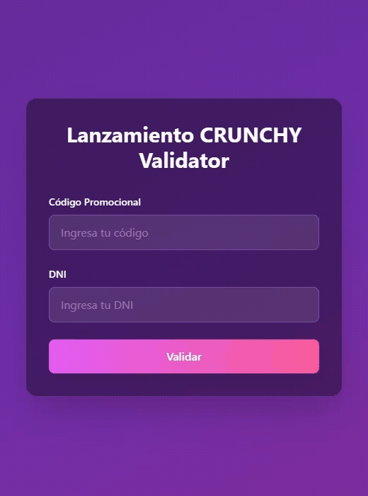

  <h3>Lanzamiento CRUNCHY Validator</h3>
  
Esta app permite verificar la validez de un código frente al DNI del cliente contra una base de datos en Supabase, y muestra detalles de sucursal y fecha cuando están disponibles. Desplegado en:

  
https://migusto.com.ar/validacion

  

## Características
- Validación de código + DNI en tiempo real contra Supabase
- UI moderna con React + Tailwind CSS
- Muestra sucursal y fecha de reserva/uso cuando existen datos
- Configurada para desplegar en subdirectorio (`/validacion/`) con `.htaccess`

## Uso
1. Ingresa el código promocional y el DNI del cliente.
2. Presiona "Validar" o Enter.
3. La app indicará si el código es válido para ese DNI.
4. Como información adicional, se mostrarán la sucursal y la fecha vinculadas al código.

## Seguridad
- Esta app realiza consultas de solo lectura con la clave `anon` de Supabase.
- No se exponen operaciones de escritura desde el cliente.
- Asegúrate de configurar correctamente RLS para limitar el acceso a lo estrictamente necesario.

## Créditos
- Departamento de Sistemas - Mi Gusto
- **Facundo Carrizo** — GitHub: [@facu14carrizo](https://github.com/facu14carrizo) · LinkedIn: [facu14carrizo](https://www.linkedin.com/in/facu14carrizo)
- **Ramiro Lacci** — GitHub: [@ramirolacci19](https://github.com/ramirolacci19) · LinkedIn: [ramiro-lacci](https://www.linkedin.com/in/ramiro-lacci)

---

### Licencia

© 2025 Mi Gusto. Todos los derechos reservados. Proyecto privado para uso comercial de la marca.

Mi Gusto ® es una empresa de La Honoria Alimentos SA - Argentina - CUIT: 30-71558654-8
